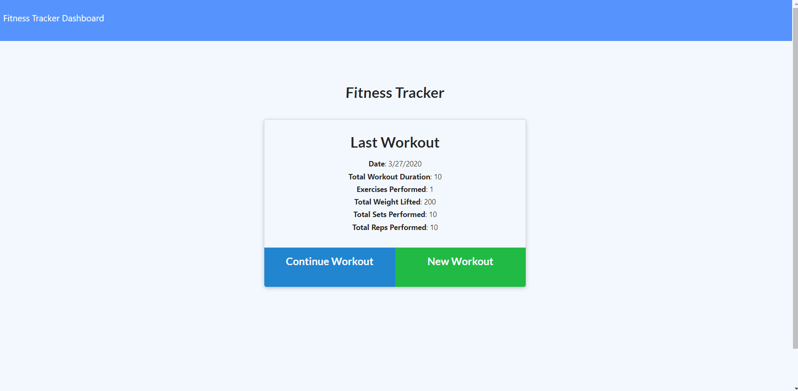

# Workout Tracker

# Links
## <a href="https://ericcwong-workout-tracker.herokuapp.com/">Heroku</a> deployed application

##  <a href="https://github.com/Ericcwong/workout-tracker">Github</a> code link

# Application
Workout Tracker is a tool that helps you keep track of your workout reps, sets, total amount of weight lifted and more! Workout tracker has a dashboard that will display your progress through out the different types of workouts either being resistance or cardio.

# Getting started 

How to get started is create a new workout by clicking on New workout. You will be prompted with the option of resistance or cardio. Select the one you want and fill out the following option. If once completed with the inputs, click either complete when you are done with your workout or click add exercise if you have another! If you want to check your progress you can click on Fitness tracker dashboard on the top left of the application. There you will see the different data displays for your workouts.

# Credit
<li><a href = "https://juliet2319.github.io/personal-portfolio/index.html">  Julie Theriault</a></li>
Julie and I worked on this homework together helping each other when we both ran into some sort of issue.
<li>The Net Ninja's <a href ="https://www.youtube.com/watch?v=sEkRmVfc8XE&t=206s">youtube REST API Tutorial (Node, Express & Mongo) </a> tutorial</li>
Net Ninja helped me understand more of the CRUD operations

# Copyright
Code is on Github, free to look and use.